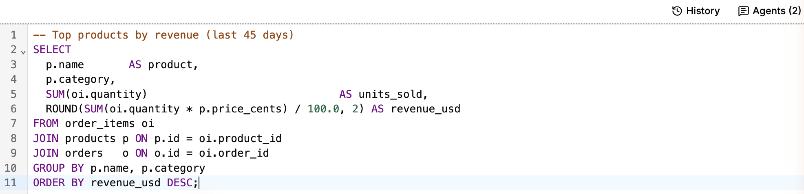
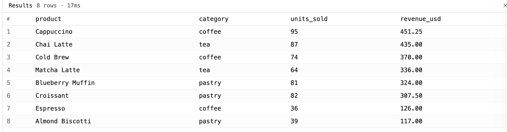
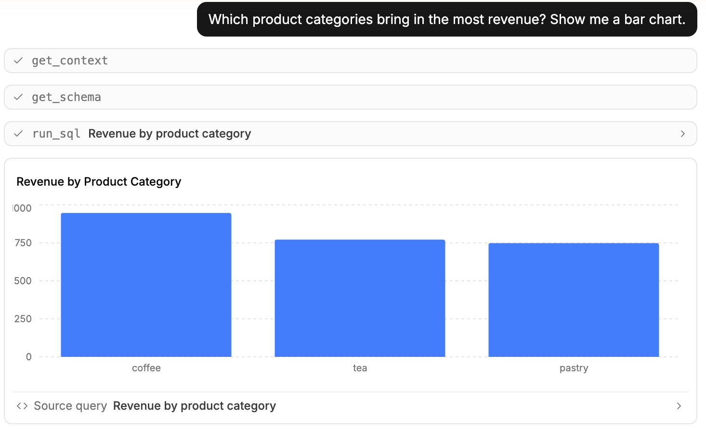
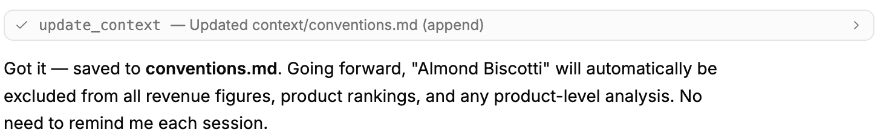
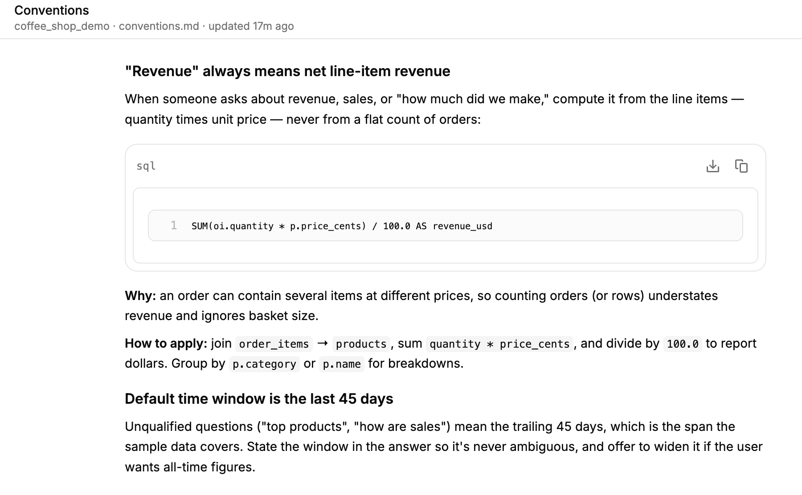
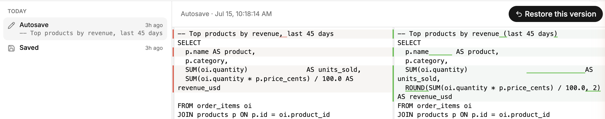

# Data Profile Tool

Data Profile Tool is a fully local, file-based SQL editor with powerful
chat-to-SQL functionality, charting, and a context layer.

## Features

### SQL editor

Write a query against a connection and run it; results appear inline.





### Chat-to-SQL agent

Ask a question in plain English. The agent reads your live schema, writes and
runs SQL, and charts the answer — with every tool call shown in the transcript,
so you see exactly what it did rather than trusting a black box.



### Transparent, versioned memory

The agent's knowledge isn't hidden in a vendor database — it's git-tracked
markdown in your repo. Correct it once and it writes the rule to its notes, then
applies it on its own from then on:



Those notes are plain markdown you read and edit in the **Documentation** view —
`Schemas`, `Conventions`, and `Feedback` per data source. Every change, yours or
the agent's, is a reviewable diff:



### Everything is a file

Worksheets are `.sql` and context is `.md`, so version history is built in — diff
any two versions of a query and restore an earlier one.



### Local-first & private

The server binds to `127.0.0.1` and credentials are encrypted in your OS
keychain. Nothing about your data leaves your machine except what you send to
your LLM provider.

### Read-only by default

Connections open read-only; you opt into writes per connection, so the agent
can't change your data unless you let it.

## Quick start

```bash
# In the directory you want as your workspace:
npx os-dpt
```

This launches a local server on `127.0.0.1` and opens the editor in your
browser. On first run it creates a workspace (see below). Add a database
connection (Postgres to start), then open a worksheet or the chat panel.

You'll need an Anthropic API key for the agent — set it in **Settings → AI
providers**.

To install it globally instead:

```bash
npm install -g os-dpt
os-dpt
```

### Options

```
os-dpt [options]

  --workspace <dir>   Workspace directory (default: current directory)
  --port <n>          Preferred port (default: 3756, falls back if taken)
  --no-open           Don't open the browser automatically
  -v, --version       Print version
  -h, --help          Show this help
```

## Workspace layout

os-dpt treats your current directory as the workspace root (like `git` or
`npm`):

```
<workspace>/
├── .os-dpt/          # gitignored — encrypted credentials, cache, drafts
├── worksheets/       # git-tracked .sql files, one per worksheet
├── context/          # git-tracked agent memory (markdown), scoped per source
├── connections.json  # connection metadata (no secrets)
└── .gitignore        # excludes .os-dpt/
```

Anything sensitive lives in `.os-dpt/` and is gitignored. Anything worth
versioning — your queries and the agent's context — is plain text at the root.

If the directory isn't already a git repository, os-dpt runs `git init` so
worksheet/context history works out of the box.

## How the agent works

Under the hood, the agent runs a small, focused tool loop (see `server/agent/`):

- `get_schema` — introspect live tables/columns.
- `get_context` / `update_context` — read and write the markdown knowledge files.
- `run_sql` — execute SQL (read-only by default; see Security).
- `write_sql` — stage SQL into a worksheet for you to review and save.
- `render_chart` — draw a chart inline from query results.
- `ask_user_question` — pause and ask rather than guess.

Because worksheets and context are just files, the collaboration is durable:
the agent rewrites a worksheet in place as you iterate, `git` keeps the full
history of both your queries and the agent's notes, and the in-app history
viewer is a thin wrapper over `git log` / `git diff` for a given file.

## Security

os-dpt is a **single-user, loopback-only** tool with no API authentication, and
the agent can run SQL against your database. **Connections are read-only by
default**; you opt into writes per connection. For the full trust model —
credential storage, the read-only guards, TLS behavior, and what gets sent to
your LLM provider — read [SECURITY.md](./SECURITY.md) before pointing it at
anything important.

## Develop

Requires Node and pnpm. This is a pnpm monorepo (`client` + `server`).

```bash
pnpm install
pnpm dev          # Vite + Hono in parallel
pnpm typecheck    # gate changes with this
```

Run the app against a throwaway workspace so you never materialize personal
data in the repo:

```bash
os-dpt --workspace ./dev-workspace
```

See [CONTRIBUTING.md](./CONTRIBUTING.md) for design principles and how to add a
database driver.

## License

[MIT](./LICENSE) © Paul Demick
